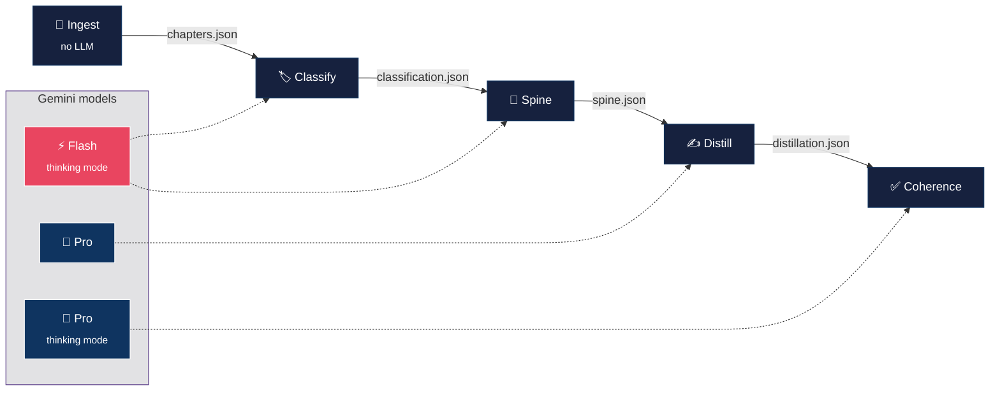

# Marrow

> **Read the marrow. Faithful book distillation for deep readers.**

Marrow turns a 300-page non-fiction book into a ~90-page faithful distillation
that preserves the argumentative arc, every named framework, key examples, and
the author's voice — with every paragraph traceable to the source via Obsidian
`^uuid` block anchors.

Not a summary. A distillation — the same book, compressed to 30%.

**Current version:** [0.2.0](https://github.com/8lianno/marrow/releases/tag/v0.2.0)

## How it works

Marrow separates **selection** (what to keep) from **generation** (how to write it).
The core insight: deciding what's load-bearing is a different cognitive job than
compressing it into prose. Split them, and both get better.


The **spine** is the key artifact — a structured skeleton listing every
framework, key example, argumentative move, key term, and voice sample per
chapter. The distillation writes against it, not from scratch. When the output
is wrong, you can see whether selection or writing failed.

### What each stage does



| Stage | Model | What it does | Cost |
|-------|-------|-------------|------|
| **Ingest** | — | Docling parses PDF/EPUB into structured chapters with page provenance | $0 |
| **Classify** | Gemini 2.5 Flash | Labels each section as intro/body/conclusion/appendix (sets compression ratio) | ~$0.02 |
| **Spine** | Gemini 2.5 Flash (thinking) | Extracts thesis, frameworks, examples, argumentative moves, key terms per chapter | ~$0.10 |
| **Distill** | Gemini 2.5 Pro | Compresses each chapter to 30% against its spine, matching the author's voice | ~$1.00 |
| **Coherence** | Gemini 2.5 Pro (thinking) | Audits whole book for gaps, voice drift, broken threads; fixes flagged chapters | ~$0.50 |

**Total: ~$1.50–2.00 per book. Runtime: ~15–25 minutes. One API key: `GEMINI_API_KEY`.**

## Getting started

### 1. Install

```bash
git clone https://github.com/8lianno/marrow.git
cd marrow
uv venv && source .venv/bin/activate
uv pip install -e .
uv pip install google-genai ebooklib
```

### 2. Set up authentication

Marrow uses **Codex CLI** by default (free with ChatGPT subscription) and
**Gemini Flash Lite** for one cheap classification call.

```bash
# Gemini key (required — used for Stage 2 classify, ~$0.001/book)
echo "GEMINI_API_KEY=your-key-here" > .env

# Codex CLI (required — used for Stages 3-5, $0 marginal cost)
codex login
```

If you don't have Codex, use the Gemini-only path instead (costs ~$0.25/book):

```bash
marrow run book.epub --config configs/gemini.yaml
```

### 3. Drop a book and run

```bash
mkdir -p input
cp ~/Downloads/your-book.epub input/

marrow run "input/your-book.epub"
```

That's it. Marrow will:
1. Parse the book into chapters (~3 seconds)
2. Classify each section type (~3 seconds)
3. Extract a structural spine per chapter (~5-10 min, 3 chapters in parallel)
4. Distill each chapter to ~30% against its spine (~10-15 min, 3 in parallel)
5. Run a coherence audit and fix any gaps (~1-2 min)
6. Export `.md`, `.epub`, and `.spine.md`

### 4. Find your output

```
runs/<book-slug>/05_coherence/
├── <slug>.epub           # clean EPUB — open in any reader
├── <slug>.md             # Obsidian markdown with spine callouts + citations
├── <slug>.spine.md       # structural skeleton (standalone)
├── <slug>.source.md      # original text with ^anchor IDs
├── manifest.json         # cost, duration, word counts
└── coherence_report.json # audit results
```

The **`.epub`** is the primary output — clean prose, no citation clutter,
with the spine shown at the top of each chapter.

The **`.md`** is for Obsidian users — includes collapsible spine callouts
and `[[wikilink]]` citations back to the source.

### 5. Options

```bash
# Re-run (wipes previous output)
marrow run book.epub --force

# Higher compression (40% instead of 30%)
marrow run book.epub --compression 0.40

# Inspect just the spine (stages 1-3, no distillation)
marrow run book.epub --spine-only

# Skip coherence audit (faster, ~70% of quality)
marrow run book.epub --skip-coherence

# Export to Obsidian vault
marrow run book.epub --vault ~/obsidian

# Use Gemini instead of Codex (faster, ~$0.25/book)
marrow run book.epub --config configs/gemini.yaml

# Resume after interruption
marrow run book.epub --resume

# Delete a run
marrow clean <book-slug>
```

### Provider comparison

| | Codex (default) | Gemini (`--config configs/gemini.yaml`) |
|---|---|---|
| Cost | ~$0.001/book | ~$0.25/book |
| Runtime | ~20 min (parallel) | ~20 min |
| Auth | `codex login` | `GEMINI_API_KEY` |
| Determinism | No (agent sampling) | Yes |
| Best for | Daily use, batch runs | Reproducibility, speed |

## CLI

```bash
marrow book.pdf                        # full pipeline
marrow book.pdf --compression 0.40     # 40% instead of default 30%
marrow book.pdf --spine-only           # stages 1-3 only (inspect the spine)
marrow book.pdf --skip-coherence       # stages 1-4 only (faster, ~70% quality)
marrow book.pdf --force                # wipe previous run and restart
marrow book.pdf --vault ~/obsidian     # copy output to Obsidian vault
marrow book.pdf --config my.yaml       # custom config file
marrow clean <book-slug>               # delete working directory
marrow version                         # print version
```

## Configuration

Config resolution: **built-in defaults → `configs/default.yaml` → `--config` file
→ env vars (`MARROW_*`) → CLI flags**.

```bash
GEMINI_API_KEY=...              # Required (Stage 2 classify)
MARROW_RUNS_DIR=./runs          # Working directory root
MARROW_OBSIDIAN_VAULT=/path     # Auto-export to vault
MARROW_COST_MAX_PER_BOOK=3.00   # Hard ceiling (metered stages only)
MARROW_LOG_LEVEL=INFO           # DEBUG | INFO | WARNING | ERROR
```

Codex authentication: runs on your existing ChatGPT subscription via `codex login`.

## Design decisions

**Why spine/distill split?** v0.1.0 had 8 stages that all tried to compensate
for weak synthesis. The spine separates the hard decision (what's load-bearing)
from the easy job (compress it). Flash-thinking is excellent at structured
extraction; Pro is excellent at prose compression against a known target.

**Why not local models?** Quality over cost. The difference between a $0.50
local-model run and a $1.50 API run is negligible for 30 books/year. The
difference in output quality is not.

**Why deterministic verification?** v0.1.0 used quiz-based validation (HAMLET,
SummQ) that couldn't distinguish "the brief is bad" from "the quiz is bad."
v0.2.0 fuzzy-matches spine items against the distillation text — if framework X
isn't mentioned, it's missing. No LLM needed for that check.

**Why continuation loops?** A dense 15,000-word chapter compressed to 30%
needs ~4,500 words of output. Gemini's output window is ~8K tokens (~6K words).
Most chapters fit in one call, but long ones need continuation. The loop uses
`finish_reason` as the primary truncation signal, not word-count heuristics.

## Development

```bash
uv pip install -e ".[dev]"
pytest tests/ -v -k "not slow"    # 18 unit tests
ruff check . && ruff format --check .
```

## Changelog

See [CHANGELOG.md](CHANGELOG.md) for a detailed history of changes.

## License

[MIT](LICENSE)
