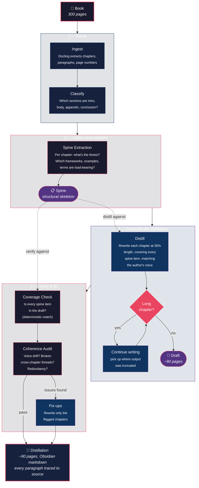
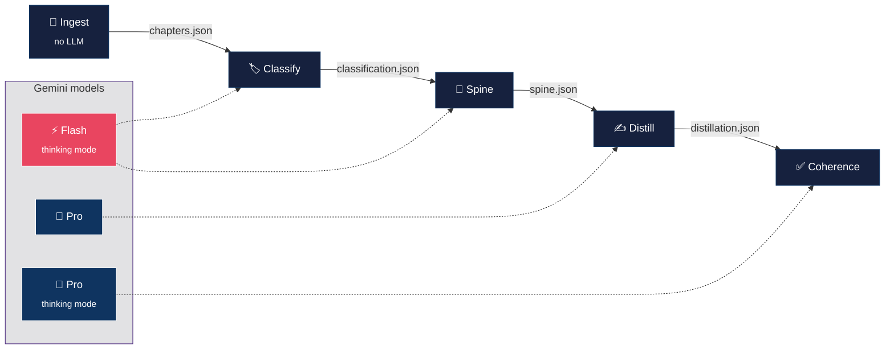

# Marrow

> **Read the marrow. Faithful book distillation for deep readers.**

Marrow turns a 300-page non-fiction book into a ~90-page faithful distillation
that preserves the argumentative arc, every named framework, key examples, and
the author's voice — with every paragraph traceable to the source via Obsidian
`^uuid` block anchors.

Not a summary. A distillation — the same book, compressed to 30%.

**Current version:** [0.2.0](https://github.com/8lianno/marrow/releases/tag/v0.2.0)

## How it works

Marrow separates **selection** (what to keep) from **generation** (how to write it).
The core insight: deciding what's load-bearing is a different cognitive job than
compressing it into prose. Split them, and both get better.



The **spine** is the key artifact — a structured skeleton listing every
framework, key example, argumentative move, key term, and voice sample per
chapter. The distillation writes against it, not from scratch. When the output
is wrong, you can see whether selection or writing failed.

### What each stage does



| Stage | Model | What it does | Cost |
|-------|-------|-------------|------|
| **Ingest** | — | Docling parses PDF/EPUB into structured chapters with page provenance | $0 |
| **Classify** | Gemini 2.5 Flash | Labels each section as intro/body/conclusion/appendix (sets compression ratio) | ~$0.02 |
| **Spine** | Gemini 2.5 Flash (thinking) | Extracts thesis, frameworks, examples, argumentative moves, key terms per chapter | ~$0.10 |
| **Distill** | Gemini 2.5 Pro | Compresses each chapter to 30% against its spine, matching the author's voice | ~$1.00 |
| **Coherence** | Gemini 2.5 Pro (thinking) | Audits whole book for gaps, voice drift, broken threads; fixes flagged chapters | ~$0.50 |

**Total: ~$1.50–2.00 per book. Runtime: ~15–25 minutes. One API key: `GEMINI_API_KEY`.**

## Quick start

```bash
# Install
uv venv && source .venv/bin/activate
uv pip install -e .

# Set API key (only one needed — everything runs on Gemini)
export GEMINI_API_KEY=...

# Distill a book
marrow book.pdf
```

Output lands in `runs/<book-slug>/05_coherence/`:

```
book-slug.md          # the distillation (~90 pages, Obsidian markdown)
book-slug.spine.md    # the structural skeleton (3-5 pages)
book-slug.source.md   # original text with ^paragraph-id anchors
manifest.json         # cost, duration, model versions
coherence_report.json # the audit results
```

## Example: first successful run

```bash
marrow run "input/No More Mr. Nice Guy! - Robert A. Glover.epub" --force
```

Results on a 55,000-word / 129-page EPUB:

| Metric | Result |
|--------|--------|
| Output | **78 pages** (21,603 words) |
| Compression | 39.5% of source |
| Spine success | 11 of 12 sections |
| Coherence | PASS (no fix-ups needed) |
| Cost | **$0.56** |
| Runtime | **21 minutes** |
| Tokens | 315K in / 84K out |

Output folder:

```
runs/no-more-mr-nice-guy-robert-a-glover/05_coherence/
├── no-more-mr-nice-guy-robert-a-glover.md           # the distillation (78 pages)
├── no-more-mr-nice-guy-robert-a-glover.spine.md     # structural skeleton
├── no-more-mr-nice-guy-robert-a-glover.source.md    # original with ^anchors
├── manifest.json                                     # run metadata
└── coherence_report.json                             # audit results
```

The `.md` file is the one you read. Open it in Obsidian and the `[p:uuid]` citations become clickable links to the `.source.md` file.

## CLI

```bash
marrow book.pdf                        # full pipeline
marrow book.pdf --compression 0.40     # 40% instead of default 30%
marrow book.pdf --spine-only           # stages 1-3 only (inspect the spine)
marrow book.pdf --skip-coherence       # stages 1-4 only (faster, ~70% quality)
marrow book.pdf --force                # wipe previous run and restart
marrow book.pdf --vault ~/obsidian     # copy output to Obsidian vault
marrow book.pdf --config my.yaml       # custom config file
marrow clean <book-slug>               # delete working directory
marrow version                         # print version
```

## Configuration

Config resolution: **built-in defaults → `configs/default.yaml` → `--config` file
→ env vars (`MARROW_*`) → CLI flags**.

```bash
GEMINI_API_KEY=...              # Required (all stages)
MARROW_RUNS_DIR=./runs          # Working directory root
MARROW_OBSIDIAN_VAULT=/path     # Auto-export to vault
MARROW_COST_MAX_PER_BOOK=3.00   # Hard ceiling (aborts if exceeded)
MARROW_LOG_LEVEL=INFO           # DEBUG | INFO | WARNING | ERROR
```

## Design decisions

**Why spine/distill split?** v0.1.0 had 8 stages that all tried to compensate
for weak synthesis. The spine separates the hard decision (what's load-bearing)
from the easy job (compress it). Flash-thinking is excellent at structured
extraction; Pro is excellent at prose compression against a known target.

**Why not local models?** Quality over cost. The difference between a $0.50
local-model run and a $1.50 API run is negligible for 30 books/year. The
difference in output quality is not.

**Why deterministic verification?** v0.1.0 used quiz-based validation (HAMLET,
SummQ) that couldn't distinguish "the brief is bad" from "the quiz is bad."
v0.2.0 fuzzy-matches spine items against the distillation text — if framework X
isn't mentioned, it's missing. No LLM needed for that check.

**Why continuation loops?** A dense 15,000-word chapter compressed to 30%
needs ~4,500 words of output. Gemini's output window is ~8K tokens (~6K words).
Most chapters fit in one call, but long ones need continuation. The loop uses
`finish_reason` as the primary truncation signal, not word-count heuristics.

## Development

```bash
uv pip install -e ".[dev]"
pytest tests/ -v -k "not slow"    # 18 unit tests
ruff check . && ruff format --check .
```

## Changelog

See [CHANGELOG.md](CHANGELOG.md) for a detailed history of changes.

## License

[MIT](LICENSE)
