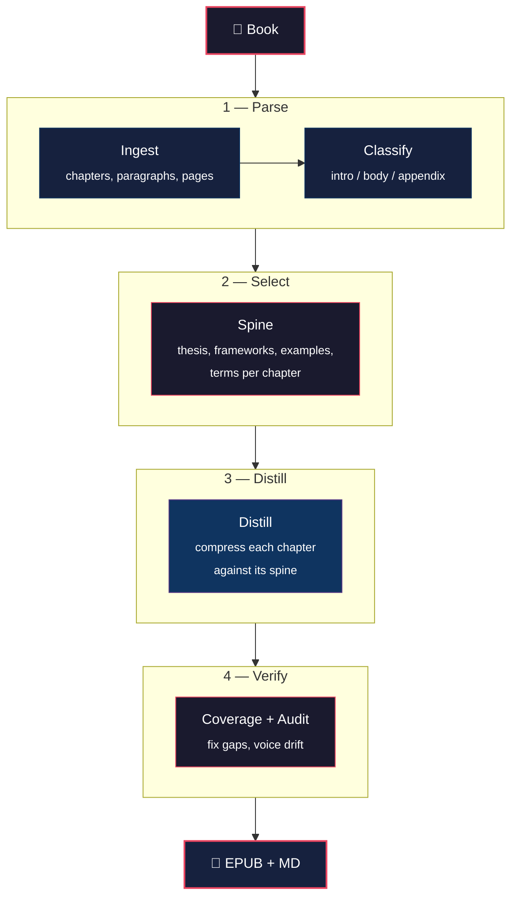

# Marrow

> **Read the marrow. Faithful book distillation for deep readers.**

Marrow turns a non-fiction book into a faithful distillation that preserves the
argumentative arc, every named framework, key examples, and the author's voice.
Drop an EPUB, get a readable EPUB back — compressed, structured, and traceable
to the source.

**Current version:** [0.3.0](https://github.com/8lianno/marrow/releases/tag/v0.3.0)

## Results

Tested on *No More Mr. Nice Guy!* (54,624 words / 129 pages):

| Metric | Result |
|--------|--------|
| Output | **92 pages** / 25,512 words |
| Compression | 47% of source |
| Chapters | 12/12 spine extracted, 12/12 distilled |
| Coherence | 2 fix-ups applied automatically |
| Runtime | **14 minutes** |
| Cost | **$0.001** (Codex default) |
| Formats | `.epub` + `.md` + `.spine.md` |

## How it works

Marrow separates **selection** (what to keep) from **generation** (how to write it).



The **spine** is the key artifact — a structured skeleton of what must survive compression. The distillation writes against it, not from scratch. When output is wrong, you can see whether selection or writing failed.

### Pipeline stages

| Stage | What | Time | Provider |
|-------|------|------|----------|
| **Ingest** | Docling parses PDF/EPUB into chapters | ~3s | — |
| **Classify** | Labels sections (intro/body/appendix) | ~5s | Gemini Flash Lite |
| **Spine** | Extracts thesis, frameworks, examples per chapter | ~6 min | Codex (3 parallel) |
| **Distill** | Compresses each chapter against its spine | ~4 min | Codex (3 parallel) |
| **Coherence** | Coverage check + audit + fix-ups + EPUB export | ~3 min | Codex |

**Total: ~14 minutes, $0.001 per book.**

## Getting started

### 1. Install

```bash
git clone https://github.com/8lianno/marrow.git
cd marrow
uv venv && source .venv/bin/activate
uv pip install -e .
uv pip install google-genai ebooklib
```

### 2. Authenticate

```bash
# Gemini key (Stage 2 classify — ~$0.001/book)
echo "GEMINI_API_KEY=your-key-here" > .env

# Codex CLI (Stages 3-5 — $0 marginal, uses ChatGPT subscription)
codex login
```

### 3. Run

```bash
marrow run "input/your-book.epub"
```

### 4. Output

```
runs/<book-slug>/05_coherence/
├── <slug>.epub           # the distillation — open in any EPUB reader
├── <slug>.md             # Obsidian markdown with spine callouts
├── <slug>.spine.md       # structural skeleton (standalone)
├── <slug>.source.md      # original text with ^anchor IDs
├── manifest.json         # cost, runtime, word counts
└── coherence_report.json # audit results
```

## CLI

```bash
marrow run book.epub                       # full pipeline (codex default)
marrow run book.epub --brief               # brief mode (~20% compression)
marrow run book.epub --compression 0.15    # explicit compression ratio
marrow run book.epub --force               # wipe previous run and restart
marrow run book.epub --config configs/gemini.yaml  # Gemini provider (~$0.25)
marrow run book.epub --vault ~/obsidian    # auto-export to Obsidian vault
marrow run book.epub --spine-only          # stages 1-3 only
marrow run book.epub --skip-coherence      # stages 1-4 only (faster)
marrow clean <book-slug>                   # delete working directory
marrow version                             # print version
```

**Auto-resume:** if the pipeline crashes mid-run, re-run the same command — completed stages are skipped automatically. Use `--force` only when you want to start fresh.

## Two modes

| | Full (default) | Brief (`--brief`) |
|---|---|---|
| Compression | ~30% target | ~20% target |
| Style | Rich narrative, all examples | Skeleton: thesis + frameworks + best example |
| Section headings | Yes | Yes |
| Best for | Reading as a book replacement | Quick reference, review |

## Providers

| | Codex (default) | Gemini (`--config configs/gemini.yaml`) |
|---|---|---|
| Cost | **$0.001**/book | ~$0.25/book |
| Runtime | ~14 min | ~20 min |
| Auth | `codex login` | `GEMINI_API_KEY` |
| Determinism | No | Yes |
| Best for | Daily use | Reproducibility |

## Configuration

```bash
GEMINI_API_KEY=...              # Required (Stage 2 classify)
MARROW_RUNS_DIR=./runs          # Working directory root
MARROW_OBSIDIAN_VAULT=/path     # Auto-export to vault
MARROW_COST_MAX_PER_BOOK=3.00   # Hard ceiling (metered stages only)
MARROW_LOG_LEVEL=INFO           # DEBUG | INFO | WARNING | ERROR
```

## Design

**Spine/distill split** — selection is separate from generation. The spine lists what must survive; the distillation writes against it.

**Smart chapter titles** — when a book has poor EPUB structure (no chapter markers), Marrow generates readable titles from the spine's first framework name.

**Parallel stages** — spine extraction and distillation run 3 chapters concurrently via `ThreadPoolExecutor`.

**Auto-resume** — if a run crashes at stage 4, re-running skips stages 1-3 automatically.

**Deterministic verification** — spine items are fuzzy-matched against the distillation text. No LLM needed for coverage checks.

## Development

```bash
uv pip install -e ".[dev]"
pytest tests/ -v -k "not slow"    # 29 unit tests
ruff check . && ruff format --check .
```

## Changelog

See [CHANGELOG.md](CHANGELOG.md) for full history.

## License

[MIT](LICENSE)
