# Marrow

> **Read the marrow. Lossless book briefs for people who refuse to skim.**

Marrow turns a 300-page non-fiction book into a ~50-page conceptual brief that
preserves every load-bearing idea, framework, definition, claim, example, and
counter-argument from the source — with every sentence in the brief traceable
to an exact paragraph in the original book.

Other tools summarize and silently drop. Marrow ships with a machine-checkable
receipt: HAMLET leaf-recall, SummQ adversarial validation, and 100% citation
traceability to `^uuid` block anchors in Obsidian.

## What makes it different

- **Lossless gate, not vibes.** Every stage that could drop content has an
  explicit audit. A brief that passes didn't just sound complete — it was
  graded against the source and survived.
- **Local-first by default.** Runs on your machine. Uses Ollama (`qwen3:14b`)
  out of the box. Zero API keys required. Zero metered billing.
- **Two modes, same output.** Either Marrow calls the LLM itself (`--mode api`,
  supports Anthropic / Gemini / OpenRouter / Ollama), or the host agent
  (Claude Code / Codex) does the reasoning via a file-based task protocol
  (`--mode host`).
- **File-based, resumable, inspectable.** No daemon, no database server. Every
  stage boundary is a Pydantic-validated JSONL artifact on disk. `ls` and `cat`
  are the debugger.

## Pipeline

```mermaid
flowchart LR
    PDF[📄 PDF / EPUB]:::input
    PDF --> S1

    subgraph Deterministic
        S1[01_ingest<br/>Docling<br/>hierarchy + pages]:::det
        S2[02_chunk<br/>Jina v2<br/>late chunking + LanceDB]:::det
    end

    subgraph LLM-backed
        S3[03_graph<br/>entities + relations<br/>Louvain communities]:::llm
        S4[04_claims<br/>atomic claims<br/>semantic dedup 0.92]:::llm
        S5[05_synthesize<br/>hierarchical merge<br/>per-chapter sections]:::llm
    end

    subgraph Lossless-gate
        S5b[05b_validate<br/>SummQ quiz<br/>≤3 iters, ≥0.90 pass]:::gate
        S6a[06a_evaluate<br/>BooookScore + FActScore<br/>HAMLET recall]:::gate
    end

    S6b[06b_export<br/>Obsidian Brief.md<br/>+ Source.md anchors]:::out

    S1 --> S2 --> S3 --> S4 --> S5 --> S5b --> S6a --> S6b
    S6b --> VAULT[📚 Obsidian vault]:::output

    classDef input fill:#222,stroke:#888,stroke-width:1px,color:#fff
    classDef det fill:#2d4a2d,stroke:#4a7a4a,color:#fff
    classDef llm fill:#3a2d4a,stroke:#5e4a7a,color:#fff
    classDef gate fill:#4a3a2d,stroke:#7a5e4a,color:#fff
    classDef out fill:#2d3a4a,stroke:#4a5e7a,color:#fff
    classDef output fill:#222,stroke:#888,stroke-width:1px,color:#fff
```



Every artifact crossing a stage boundary is a Pydantic v2 model serialized to
JSONL in `runs/<book-slug>/<NN>_<stage>/`. Resuming mid-pipeline (`--resume`)
skips any stage that wrote a `_complete` marker.

## Quick start

```bash
# Install
uv venv && source .venv/bin/activate
uv pip install -e ".[dev]"

# Default: host mode (no API key, your host agent does the reasoning)
marrow run path/to/book.pdf

# API mode with local Ollama (qwen3:14b on localhost:11434)
marrow run path/to/book.pdf --mode api

# API mode with OpenRouter or Gemini or Anthropic
marrow run path/to/book.pdf --mode api --config configs/openrouter.yaml
marrow run path/to/book.pdf --mode api --config configs/gemini.yaml
marrow run path/to/book.pdf --mode api --config configs/anthropic.yaml

# Resume after interruption
marrow run path/to/book.pdf --resume

# Inspect per-stage progress
marrow status <book-slug>
```

## Configuration

Config resolution: **defaults → `configs/default.yaml` → user `--config` file
→ env vars (`MARROW_*`) → CLI flags** (later overrides earlier).

Presets in `configs/`:

| File | Purpose |
|---|---|
| [`default.yaml`](configs/default.yaml) | Local Ollama everywhere, $0 metered cost |
| [`cheap.yaml`](configs/cheap.yaml) | Local-only, cost cap $0.50 |
| [`openrouter.yaml`](configs/openrouter.yaml) | OpenRouter gateway (needs `OPENROUTER_API_KEY`) |
| [`gemini.yaml`](configs/gemini.yaml) | Gemini Flash + Pro (needs `GEMINI_API_KEY`) |
| [`anthropic.yaml`](configs/anthropic.yaml) | Sonnet 4.6 for synthesis + validation (needs `ANTHROPIC_API_KEY`) |

Model routing is per-role. For example, `anthropic.yaml` uses local Ollama for
the hot per-chunk work (claims + graph) but Sonnet for synthesis + validation
where quality matters most.

## Docs

- [PRD.md](PRD.md) — product requirements, user stories, acceptance metrics
- [ARCHITECTURE.md](ARCHITECTURE.md) — principles, stage contract, decisions
- [ROADMAP.md](ROADMAP.md) — M0 walking skeleton → M1–M6 stage-fill milestones
- [HOST_MODE.md](HOST_MODE.md) — task/result protocol for Claude Code / Codex
- [API.md](API.md) — CLI surface + internal module APIs + stage contract
- [DATABASE.md](DATABASE.md) — working-directory layout + SQLite cost ledger
- [BRAND.md](BRAND.md) — name, voice, positioning
- [REPOS.md](REPOS.md) — upstream open-source inventory
- [CLAUDE.md](CLAUDE.md) — per-session dev guide for Claude Code / Codex

## Status

All eight stages real end-to-end. 61 fast tests passing. Known gaps:

- Tested on tiny synthetic fixtures, not a real 300-page book yet.
- Current default model (`qwen3:14b` local) is strong for extraction but
  verbose for synthesis; `configs/anthropic.yaml` or `configs/gemini.yaml`
  produce cleaner briefs when you need PASS verdicts.
- No polished Claude Code / Codex skill file for Host Mode yet — the protocol
  works, but a host-agent playbook needs to land before the UX feels seamless.

## License

[MIT](LICENSE)
